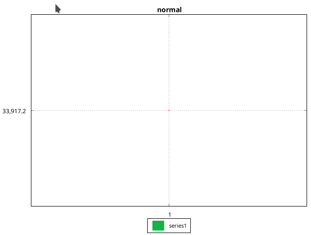

# renkodf-java
Transform Tick Data into OHLCV Renko! <br>
**Java Implementation of [renkodf](https://github.com/srlcarlg/renkodf)**

  -  |  -  |  -
:-------------------------:|:-------------------------:|:-------------------------:
  |   |  

Java OHLC charts plotted by [XChart](https://github.com/knowm/XChart)
## Usage
In essence, it's the same way as in Python version. <br>
The 'only' difference is using the OHLCV wrapper for Ticks/Renko list.

```java
import renkodf.Renko;
import renkodf.wrappers.OHLCV;

List<OHLCV> ticksList = new ArrayList<>();
// only Close and Datetime are needed.

Renko r = Renko(ticksList, brickSize);
List<OHLCV> renkoList = r.renkodf("wicks");

```
## Tests and examples
The tests verify that the OHLCV data  _(with floating-point-arithmetic)_  of all(7) renko-modes is **strictly equal** to the  _renkodf python_  version. <br>
The Ticks data used is the same as in the  _renkodf_  repository and the validation data is obtained from it.

There are 3 simple examples using the XChart to plot data.

## Dependencies
[JUnit 5](https://github.com/junit-team/junit5/) testing framework <br>
[parquet-io-java](https://github.com/exasol/parquet-io-java) to read Parquet files. <br>
[XChart](https://github.com/knowm/XChart) for plotting data / create charts.

#### Notes
* `add_columns` parameter was not implemented due to its unnecessary.
* renkodf-java is the reason why v1.1 in python was released. The otimized code came from here.